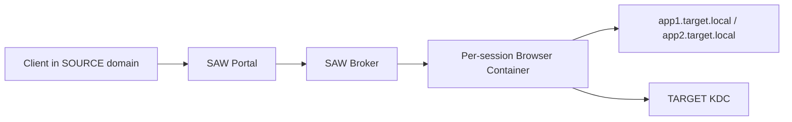

# SAW - Secure Application Workspace

SAW is a controlled browser-isolation workspace, not an authentication bypass. Browser sessions run in the target-reachable environment. Client workstations do not require direct connectivity to TARGET domain controllers.

## Sandbox
- `docker compose up --build`
- Portal: `http://localhost:8080`
- noVNC: `http://localhost:6901`

## Security stance
High-risk capabilities (downloads, uploads, printing, clipboard out, dev tools, persistence) are denied by default and can only be enabled via explicit group policy.

## Offline deployment
Use `scripts/online/Export-SAWImages.ps1` and `scripts/offline/Import-SAWImages.ps1`.

## Known limitations
v1 uses mock group resolution in sandbox mode and does not implement full production Windows auth negotiation in Linux-hosted containers.
